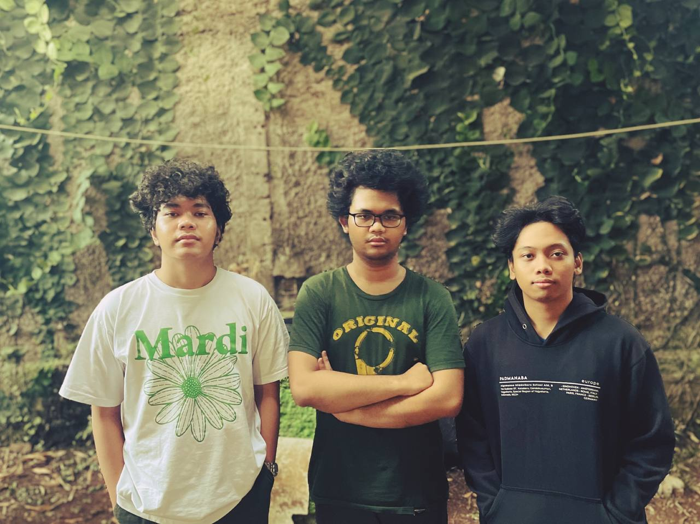

# Tugas Besar 2 IF2123 Aljabar Linear dan Geometri 2023

Content-Based Information Retrival (CBIR) Implementation on a Website with NextJS and FastAPI

## Developers
> "ordinary people with extraordinary curiosity"

|   NIM    |          Nama          |         Hobi         |
| :------: | :--------------------: | :------------------: |
| 13522131 |  Owen Tobias Sinurat   |      Dukung MU       |
| 13522155 |  Axel Santadi Warih  | Sawer Waifu |
| 13522142 | Farhan Raditya Aji |   Makan Gudeg    |

## How to Run?

### FrontEnd  
1. Open a terminal on the repository folder 
2. Change to the website directory:
```
cd src/website
``` 
3. Install all required dependencies:  
```
npm i
```
4. After installing all dependencies, run the website:  
```
npm run dev
```
5. Open localhost:3000 on your browser
  
6. Wait for a couple of seconds until the website loads

### BackEnd  
1. Open another terminal on the repository folder   
2. Change to the backend directory:
```
cd src/backend
```
3. Install all required dependencies:
```
pip install -r requirements.txt
```
4.  After installing all dependencies, run the backend server:
```
python3 -m uvicorn index:app --reload
```

After correctly following all the steps, you can use the website to see the CBIR implementation. 
Instructions on the features is provided on the website.
